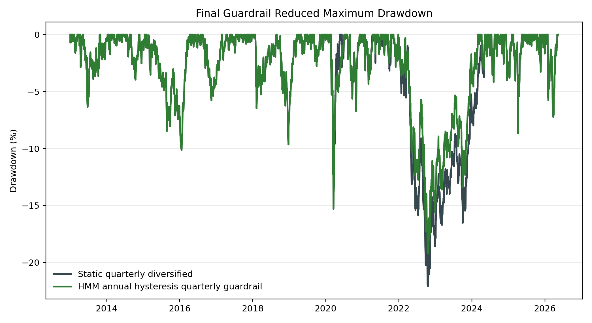
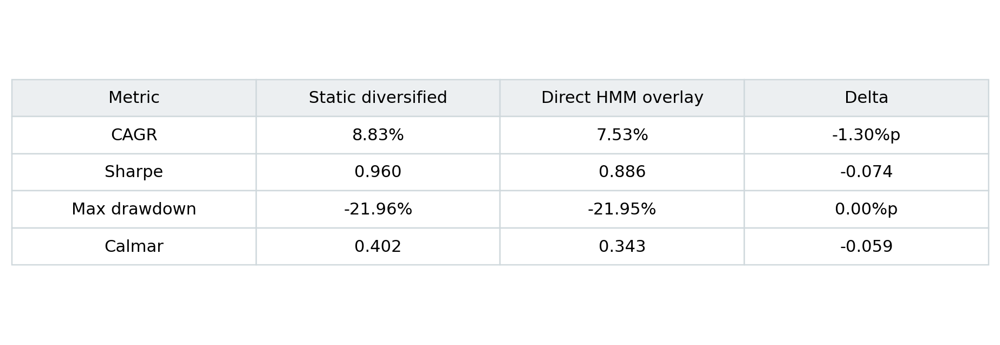
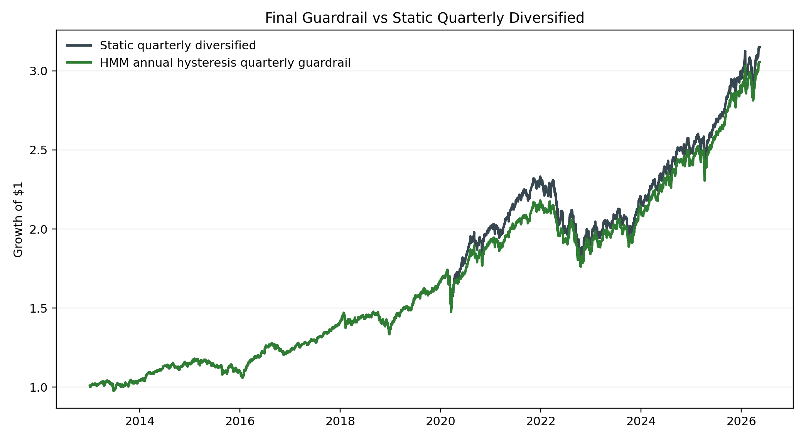

# Macro-Regime HMM Guardrail

거시·시장 변수로 추정한 2-state Hidden Markov Model(HMM)을 정적 자산배분의 저빈도 위험관리 가드레일로 활용한 연구 프로젝트입니다.

이 저장소는 전체 실험 로그를 보관하기 위한 아카이브가 아닙니다. 최종 발표와 결론을 이해하고 핵심 검증을 재현하는 데 필요한 코드, 최소 처리 데이터, 대표 결과만 정리했습니다.



## 연구 질문

거시·금융 변수로 식별한 시장 국면을 활용하면 정적 분산 포트폴리오의 위험조정 성과를 개선할 수 있는가?

연구를 진행하며 질문은 다음과 같이 구체화됐습니다.

> HMM을 독립적인 수익 예측 엔진이 아니라, 스트레스 환경에서 위험 노출을 줄이는 실용적인 가드레일로 사용할 수 있는가?

## 최종 결론

2-state HMM은 직접적인 자산배분 알파 신호로 사용했을 때 OOS에서 안정적이지 않았습니다. 반면 다음 제약을 적용한 저빈도 가드레일은 비교적 일관된 손실 방어 효과를 보였습니다.

- 연간 expanding-window 재학습
- 스트레스 진입·해제에 서로 다른 임계값을 적용하는 hysteresis
- 스트레스 신호의 연속 확인
- 분기 리밸런싱
- 실제 보유 비중의 drift와 거래비용 반영

기준 포트폴리오(SPY 45%, TLT 25%, GLD 15%, DBC 10%, CASH 5%)의 분기 리밸런싱 결과는 다음과 같습니다.

| 지표 | 정적 분기 리밸런싱 | HMM 가드레일 | 변화 |
|---|---:|---:|---:|
| CAGR | 8.71% | 8.47% | -0.24%p |
| Sharpe | 0.963 | 0.977 | +0.014 |
| Max Drawdown | -22.09% | -19.20% | +2.90%p |
| Calmar | 0.394 | 0.441 | +0.047 |

핵심 해석은 다음과 같습니다.

> HMM의 가치는 높은 예측 정확도가 아니라, 위험이 누적될 때 규칙에 따라 방어적으로 개입하는 데 있다.

## 모델 개요

### 입력 축

거시·시장 변수를 경제적 방향에 맞춰 표준화하고 다섯 개 축으로 구성했습니다.

- Inflation Pressure
- Growth Weakness
- Financial Stress
- Policy Tightness
- Transition Instability

### 국면 모델

- 2-state Gaussian HMM
- State 0: 상대적으로 낮은 스트레스 환경
- State 1: 상대적으로 높은 스트레스 환경
- 자산배분에는 hard state보다 stress posterior probability를 사용

### 포트폴리오

| 자산 | Base | Stress |
|---|---:|---:|
| SPY | 45% | 20% |
| TLT | 25% | 30% |
| GLD | 15% | 20% |
| DBC | 10% | 7% |
| CASH | 5% | 23% |

## 실험 흐름

```text
3-state HMM
→ 과도한 상태 전환과 낮은 경제적 구분력 발견
→ 2-state HMM으로 단순화
→ posterior를 직접 비중에 반영하는 방식의 OOS 실패
→ 재학습 경계의 신호 불안정성 진단
→ 연간 재학습 + hysteresis + 분기 리밸런싱
→ drift-aware 벤치마크와 공정 비교
→ 비중·임계값·거래비용·TED 제거 강건성 검증
```

자세한 연구 경로는 [docs/experiment-journey.md](docs/experiment-journey.md)를 참고하세요.

## 저장소 구조

```text
.
├─ code/                       # 최종 연구 경로의 Python 코드
├─ data/processed/             # 핵심 검증용 최소 처리 데이터
├─ docs/                       # 방법론, 실험 경로, 한계
├─ presentation/               # 최종 발표자료
├─ results/
│  ├─ figures/                 # 대표 그래프
│  ├─ reports/                 # 최종 단계 보고서
│  └─ tables/                  # 핵심 결과표
├─ run_reproduction.py         # Stage 14~34 핵심 파이프라인 실행
└─ requirements.txt
```

## 실행 방법

Python 3.10 이상을 권장합니다.

```bash
python -m venv .venv
```

Windows:

```powershell
.\.venv\Scripts\Activate.ps1
pip install -r requirements.txt
python run_reproduction.py
```

macOS/Linux:

```bash
source .venv/bin/activate
pip install -r requirements.txt
python run_reproduction.py
```

실행 결과는 Git 추적에서 제외된 `outputs/`에 생성됩니다. 전체 실행에는 반복적인 HMM 학습이 포함되어 시간이 걸릴 수 있습니다.

## 대표 결과

### 직접 배분 방식의 한계



HMM posterior를 매일 자산 비중에 직접 반영하면 재학습 경계의 확률 변화와 추정 오차가 거래로 전달됩니다. 이 결과를 바탕으로 HMM의 역할을 직접 배분 엔진에서 저빈도 위험 가드레일로 축소했습니다.

### 최종 가드레일



### 강건성

- 다섯 개 base allocation에서 가드레일 조건 통과
- 임계값·거래비용 조합 180개에서 사전 정의된 조건 통과
- 10bp 거래비용까지 결론 유지
- 중단된 TEDRATE를 제거한 검증에서도 pass/fail 변화 0/180
- DAG 기반 배분은 강한 인과 가정을 부여해도 HMM 가드레일을 대체하지 못함

## 발표자료

[최종 발표자료](presentation/macro-regime-hmm-guardrail-presentation.pptx)

## 데이터 출처

- ETF 및 시장 데이터: Yahoo Finance (`yfinance`)
- 거시·금융 데이터: Federal Reserve Economic Data(FRED)

`data/processed/`에는 최종 검증 재현을 위한 최소 처리 데이터 스냅샷이 포함되어 있습니다. 데이터의 원출처, 수정 가능성, 발표 지연 및 라이선스 조건은 각 제공처 정책을 따릅니다.

## 한계

- historical walk-forward 결과이며 실제 live 운용 기록이 아닙니다.
- 최초 발표치 전체를 복원한 완전한 vintage 데이터베이스를 사용하지 않았습니다.
- 세금과 시장충격 비용은 반영하지 않았습니다.
- DBC는 선물 롤 수익률, 추적오차 및 세금 구조의 영향을 받을 수 있습니다.
- 결과는 선택한 ETF 유니버스와 표본기간에 의존합니다.
- DAG/DML 결과는 설명 및 진단용이며 입증된 인과효과로 해석할 수 없습니다.

자세한 내용은 [docs/limitations.md](docs/limitations.md)를 참고하세요.

## 면책

본 저장소는 연구 및 교육 목적입니다. 투자 권유나 운용 성과 보장을 의미하지 않습니다.
